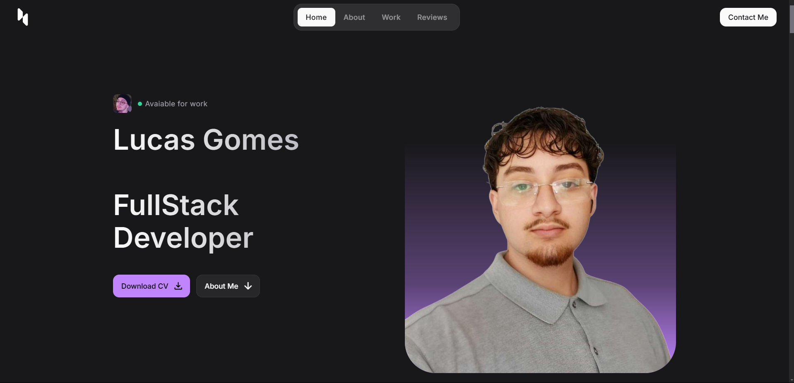

<!--- # "Can be a image or a gift from the project pages" -->

  

# My Portfolio

Welcome to my portfolio! This project was created to present my skills, experiences and projects developed throughout my professional and academic journey.

## Tech Stack

<!--- # "Verify icons availability here https://github.com/tandpfun/skill-icons" -->

## License

This software is available under the following licenses:

