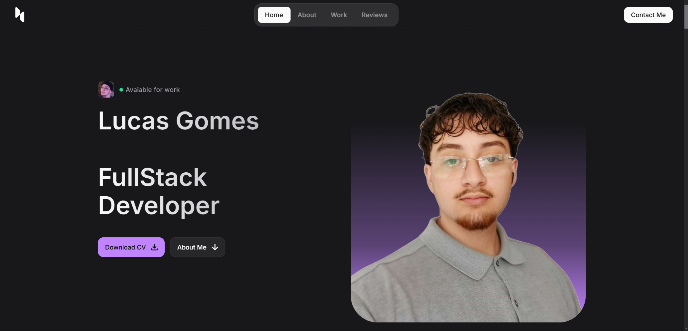

<!--- # "Can be a image or a gift from the project pages" -->

  

# Meu Portfólio

Bem-vindo ao meu portfólio! Este projeto foi criado para apresentar minhas competências, experiências e projetos desenvolvidos ao longo de minha trajetória profissional e acadêmica.

## Ferramentas Utilizadas

<!--- # "Verify icons availability here https://github.com/tandpfun/skill-icons" -->

## Licença

Este software está disponível sob as seguintes licenças:

